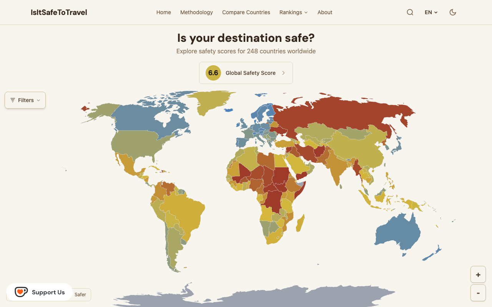

# IsItSafeToTravel

Free, open-source travel-safety scores and government advisories for 248 countries, recomputed daily — live at **[isitsafetotravel.org](https://isitsafetotravel.org)**.

[](LICENSE)
[](https://creativecommons.org/licenses/by-nc/4.0/)
[](https://github.com/RiccardoDominici/IsItSafeToTravel/actions/workflows/data-pipeline.yml)
[](https://astro.build)



## What it is

A single 1–10 safety score for **248 countries**, recomputed daily from five weighted pillars — conflict (30%), crime (25%), health (20%), governance (15%), environment (10%). Each pillar blends public risk indices (Global Peace Index, INFORM Risk Index, World Bank, V-Dem, UCDP conflict data) with **government travel advisories** from dozens of countries — see the live [sources page](https://isitsafetotravel.org/en/sources/) for exactly which governments and indices are active in today's snapshot.

## Data & API

No API key, no registration, no rate limits. Every endpoint is a static file on a global CDN with CORS enabled, so you can fetch it directly from a browser or a script.

```bash
# Full dataset: all 248 countries, composite + per-pillar scores, advisories, sources
curl -s https://isitsafetotravel.org/scores.json | jq '.countries[] | select(.iso3=="ITA")'

# Same dataset as a flat CSV, one row per country
curl -s https://isitsafetotravel.org/scores.csv | head
```

Each entry in `scores.json`'s `countries` array:

| Field | Description |
|---|---|
| `iso3` | ISO 3166-1 alpha-3 country code (e.g. `"ITA"`) |
| `name` | Country name, localized in all 7 supported languages |
| `score` | Composite safety score, 1–10 scale (10 = safest) |
| `scoreDisplay` | `score` rounded for display |
| `confidence` | 0–1, how much fresh data backs the score (low = closer to a conservative regional prior than to hard local evidence) |
| `pillars` | The 5 pillars above, each with its score, weight, and underlying indicators |
| `advisories` | Government travel-advisory levels, keyed by issuing country |
| `sources` | Public data sources used for this country, with fetch dates |

Full endpoint reference (slim map data, per-country history/trend, embeddable SVG badges, AI-readable `llms.txt`): **[isitsafetotravel.org/en/api](https://isitsafetotravel.org/en/api/)**.

## How to cite

This repository includes a [`CITATION.cff`](CITATION.cff) — use GitHub's **Cite this repository** button (repo sidebar) for an auto-generated APA/BibTeX citation. For the live dataset, the **[Cite This Data](https://isitsafetotravel.org/en/cite-this-data/)** page has ready-made attribution (plain text, HTML, Markdown, APA, MLA, BibTeX) for the whole dataset or any single country.

One-line citation for the whole dataset:

> IsItSafeToTravel. (2026). *Global travel safety scores* [Data set]. IsItSafeToTravel.org. Retrieved September 26, 2026, from https://isitsafetotravel.org

## Methodology

- **Uncertainty-weighted scoring** — each pillar shrinks toward a conservative, region-informed prior when data is thin or stale (Bayesian shrinkage); missing data collapses to the prior, it never inflates the score.
- **Geometric mean, not average** — the 5 pillars combine so that one dangerously low pillar drags the composite down more than a strong one can lift it.
- **No hard cutoffs** — advisory consensus and severe-risk signals apply as continuous adjustments, never as pass/fail thresholds or caps.
- **Freshness decay** — each source has a half-life; data older than that loses statistical weight over time instead of being trusted indefinitely.
- **Score bands** — `<5` danger, `5–6` high caution, `6–7` moderate, `7–8` good, `≥8` excellent (practical range ≈ 3.4–8.9).

Full derivation, constants, and worked examples: **[isitsafetotravel.org/en/methodology](https://isitsafetotravel.org/en/methodology/)**.

## Development

Requires Node.js 22+.

```bash
npm install
npm run dev            # Astro dev server
npm run build           # generate:og -> generate:llms -> astro build -> validate:seo (~400s)
npm run validate:seo    # post-build SEO gate against dist/client, must stay all-pass

npm run pipeline                          # fetch -> score -> snapshot -> news, for today
npx tsx src/pipeline/run.ts 2026-03-20    # ...or for a specific date

npm test                                                    # pipeline + scoring-engine unit tests
npx tsx --test src/pipeline/news/__tests__/engine.test.ts   # news-engine tests (needs tsx, not plain node --test)
```

Astro 6 static site (SSG, no server rendering) styled with Tailwind CSS 4, deployed on Cloudflare Pages. A daily GitHub Actions workflow (`data-pipeline.yml`) fetches all sources, recomputes scores, commits the new snapshot, and triggers a redeploy.

## Contributing

Issues and pull requests are welcome. If a government's advisory level looks wrong, please open an issue with a link to the country page showing it (e.g. `https://isitsafetotravel.org/en/country/ita/`) — that's the fastest way to trace it back to the source and the parser that reads it.

## License

**Code** — MIT. See [LICENSE](LICENSE).

**Data and published site content** produced by this project (the website's page text, `data/scores/`, `data/history/`, `data/news/`, `data/sentiment/`, `public/scores.json`, the `/api/` endpoints, `public/llms.txt` / `public/llms-full.txt`) is licensed under [Creative Commons BY-NC 4.0](https://creativecommons.org/licenses/by-nc/4.0/): free to reuse and adapt for non-commercial purposes, with credit to "IsItSafeToTravel.org" and a link back.

**Third-party inputs** (`data/raw/`: government travel advisories, Global Peace Index, World Bank, UCDP, INFORM, V-Dem, ReliefWeb, GDACS) remain under their original publishers' own terms.

Dependencies and third-party assets keep their own licenses.
